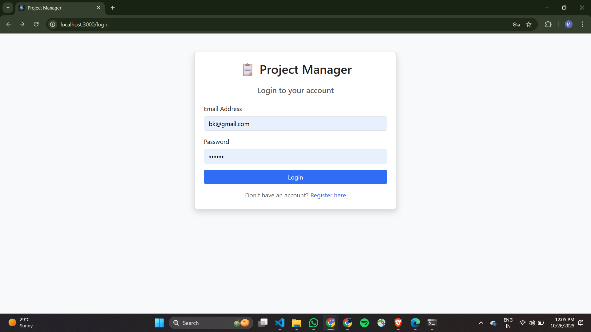

# 📋 Mini Project Manager with Smart Scheduler

A full-stack project management application with AI-powered task scheduling capabilities.


---

## 🎯 Project Overview

**Objective**: Build a comprehensive project management system with user authentication, CRUD operations, and intelligent task scheduling.

**Key Features Implemented**:
- ✅ JWT-based authentication with secure password hashing
- ✅ Complete project and task management
- ✅ Smart task scheduler with conflict detection
- ✅ Productivity analytics dashboard
- ✅ Responsive Bootstrap UI

---

## 🛠 Tech Stack

### Backend
- **.NET 8** - Web API
- **Entity Framework Core** - ORM with SQLite
- **JWT Authentication** - Secure token-based auth
- **BCrypt** - Password hashing

### Frontend
- **React 18** with **TypeScript**
- **React Router** - Navigation
- **Bootstrap 5** - Responsive UI
- **Axios** - API integration

---

## 📋 Prerequisites

- .NET 8 SDK ([Download](https://dotnet.microsoft.com/download/dotnet/8.0))
- Node.js v16+ ([Download](https://nodejs.org/))
- Git

---

## 🚀 Installation & Setup

### 1. Clone Repository
```bash
git clone <repository-url>
cd ProjectManager
```

### 2. Backend Setup
```bash
cd ProjectManager.API
dotnet restore
```

### 3. Frontend Setup
```bash
cd frontend
npm install
```

---

## ▶️ Running the Application

### Start Backend (Terminal 1)
```bash
cd ProjectManager.API
dotnet run
```
Backend runs on: `http://localhost:5000`

### Start Frontend (Terminal 2)
```bash
cd frontend
npm start
```
Frontend runs on: `http://localhost:3000`

---

## 📸 Screenshots

### Authentication

*Secure login with JWT authentication*


*User registration with validation*

### Dashboard

*Main dashboard with projects and analytics*

### Project Management

*Project cards with progress tracking*


*Detailed project view with tasks*

### Task Management

*Task list with priority indicators*


*Task creation with priority and estimated hours*

### Smart Scheduler

*Smart scheduler feature*


*Visual timeline of scheduled tasks*

---

## 🔑 Core Features Implemented

### 1. Authentication & Authorization
- User registration with email validation
- Secure login with JWT tokens
- Password hashing using BCrypt
- Protected routes and API endpoints
- Token-based session management (7-day expiry)

### 2. Project Management
- Create projects (title: 3-100 chars, description: 0-500 chars)
- View all user projects with statistics
- Delete projects with cascade deletion
- Automatic timestamp tracking

### 3. Task Management
- Add tasks with:
  - Title (required)
  - Priority (High/Medium/Low)
  - Estimated hours (1-24)
  - Optional due date
- Mark tasks complete/incomplete
- Update task details
- Delete tasks
- Visual indicators for overdue and due-soon tasks

### 4. Smart Scheduler Algorithm
**Implementation**:
```
1. Fetch all incomplete tasks
2. Sort by: Priority (High→Low) → Due Date (Earliest first)
3. Assign time slots:
   - High Priority: 9 AM - 12 PM (Morning)
   - Medium Priority: 2 PM - 5 PM (Afternoon)
   - Low Priority: 5 PM - 6 PM (Evening)
4. Detect conflicts (overlapping time ranges)
5. Skip weekends and after-hours
6. Return schedule with conflict warnings
```

**Features**:
- Automatic task scheduling based on priority and deadlines
- Conflict detection for overlapping tasks
- Work hours optimization (9 AM - 6 PM, Mon-Fri)
- Visual timeline representation

### 5. Productivity Insights
Real-time analytics showing:
- Tasks completed this week
- On-time delivery rate
- Average completion time
- Overdue task count
- Progress indicators

---

## 📁 Project Structure
```
ProjectManager/
├── ProjectManager.API/              # Backend
│   ├── Controllers/                 # API endpoints
│   │   ├── AuthController.cs
│   │   ├── ProjectsController.cs
│   │   ├── TasksController.cs
│   │   └── SchedulerController.cs
│   ├── Models/                      # Database entities
│   │   ├── User.cs
│   │   ├── Project.cs
│   │   ├── ProjectTask.cs
│   │   └── TaskPriority.cs
│   ├── Services/                    # Business logic
│   │   ├── AuthService.cs
│   │   └── SmartSchedulerService.cs
│   ├── DTOs/                        # Data transfer objects
│   ├── Data/
│   │   └── AppDbContext.cs          # EF Core context
│   └── Program.cs                   # Configuration
│
└── frontend/                        # Frontend
    ├── src/
    │   ├── components/              # React components
    │   │   ├── Navbar.tsx
    │   │   ├── ProjectCard.tsx
    │   │   ├── TaskItem.tsx
    │   │   ├── CreateProjectModal.tsx
    │   │   ├── CreateTaskModal.tsx
    │   │   ├── ScheduleTimeline.tsx
    │   │   └── ProductivityInsights.tsx
    │   ├── pages/                   # Page components
    │   │   ├── Login.tsx
    │   │   ├── Register.tsx
    │   │   ├── Dashboard.tsx
    │   │   └── ProjectDetails.tsx
    │   ├── services/                # API integration
    │   │   ├── api.ts
    │   │   └── authService.ts
    │   └── types/                   # TypeScript types
    └── package.json
```

---

## 🔌 API Endpoints

### Authentication
```
POST /api/auth/register    # Register new user
POST /api/auth/login       # User login
```

### Projects
```
GET    /api/projects           # Get all user projects
POST   /api/projects           # Create project
GET    /api/projects/{id}      # Get project by ID
DELETE /api/projects/{id}      # Delete project
POST   /api/projects/{id}/tasks # Add task to project
```

### Tasks
```
PUT    /api/tasks/{id}     # Update task
DELETE /api/tasks/{id}     # Delete task
```

### Scheduler
```
POST /api/scheduler/auto-schedule  # Auto-schedule tasks
GET  /api/scheduler/conflicts      # Get conflicts
GET  /api/scheduler/insights       # Get analytics
```

---

## 🗄 Database Schema
```sql
Users
├── Id (PK)
├── Email (Unique Index)
├── PasswordHash
└── CreatedAt

Projects
├── Id (PK)
├── Title
├── Description
├── CreatedAt
└── UserId (FK → Users) [Cascade Delete]

Tasks
├── Id (PK)
├── Title
├── DueDate
├── IsCompleted
├── Priority (Enum: 1=Low, 2=Medium, 3=High)
├── EstimatedHours
├── ScheduledStartTime
├── ScheduledEndTime
└── ProjectId (FK → Projects) [Cascade Delete]
```

---

## 🎨 Key Implementation Details

### 1. Security
- **BCrypt** password hashing with automatic salting
- **JWT** tokens with 7-day expiration
- **CORS** configuration for frontend-backend communication
- **Input validation** using Data Annotations
- **User isolation** - users can only access their own data

### 2. Smart Scheduler Algorithm
```csharp
// Pseudo-code
public async Task<ScheduleResponse> AutoScheduleTasks(userId)
{
    // 1. Get incomplete tasks
    var tasks = GetIncompleteTasks(userId);
    
    // 2. Sort by priority then due date
    tasks = tasks.OrderByDescending(t => t.Priority)
                 .ThenBy(t => t.DueDate);
    
    // 3. Schedule each task
    var currentTime = GetNextWorkingHour(DateTime.Now);
    foreach (var task in tasks)
    {
        task.ScheduledStartTime = GetOptimalStartTime(currentTime, task.Priority);
        task.ScheduledEndTime = task.ScheduledStartTime.AddHours(task.EstimatedHours);
        currentTime = task.ScheduledEndTime;
        
        // Skip to next work day if after hours
        if (currentTime.Hour >= 18)
            currentTime = NextWorkDay(currentTime).AddHours(9);
    }
    
    // 4. Detect conflicts
    var conflicts = DetectConflicts(tasks);
    
    return new ScheduleResponse { Tasks = tasks, Conflicts = conflicts };
}
```

### 3. Frontend State Management
- **React Hooks** (useState, useEffect) for local state
- **localStorage** for JWT token persistence
- **Axios interceptors** for automatic token injection
- **React Router** for protected routes

---

## ✅ Testing the Application

### Manual Testing Steps

1. **Register & Login**
   - Register: http://localhost:3000/register
   - Login: http://localhost:3000/login

2. **Create Project**
   - Click "+ New Project"
   - Enter title and description
   - Verify project appears in dashboard

3. **Add Tasks**
   - Click "View Details" on a project
   - Click "+ Add Task"
   - Add multiple tasks with different priorities
   - Verify tasks appear with correct badges

4. **Use Smart Scheduler**
   - Click "🤖 Auto-Schedule Tasks" on dashboard
   - Verify scheduling results modal
   - Check "Schedule" tab for timeline view
   - Verify conflict detection (if any)

5. **Check Analytics**
   - Complete some tasks
   - View productivity insights on dashboard
   - Verify metrics update correctly

---

## 🔧 Configuration

### Backend (appsettings.json)
```json
{
  "ConnectionStrings": {
    "DefaultConnection": "Data Source=projectmanager.db"
  },
  "Jwt": {
    "Key": "YourSuperSecretKeyThatIsAtLeast32CharactersLong!",
    "Issuer": "ProjectManagerAPI",
    "Audience": "ProjectManagerClient"
  }
}
```

### Frontend (src/services/api.ts)
```typescript
const API_BASE_URL = 'http://localhost:5000/api';
```

---


## 🚀 Production Considerations

For deployment, update:
- JWT secret key in `appsettings.json`
- CORS origins in `Program.cs`
- API URL in frontend `api.ts`
- Use PostgreSQL/SQL Server for production database
- Enable HTTPS
- Add rate limiting
- Implement environment variables for secrets


**Built with** ❤️ **using .NET 8, React, TypeScript, and Bootstrap**